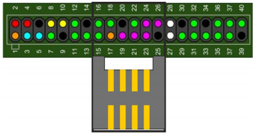

# Installation guide for having IQRF GW in Docker container

## IoT Starter Kit - Part 2: IQRF GW

### Step 1 - Insert IQRF Coordinator



* Attach [IQRF SPI board](http://www.iqrf.org/weben/downloads.php?id=412)
* Insert prepared IQRF Coordinator to the IQRF SPI board

### Step 2 - Install OS Linux

* Install [UbiLinux 4.0](https://up-community.org/downloads/download/44-ubilinux/90-ubilinux-installer-4-0)
* Post-install tips

```bash
sudo apt update && sudo apt full-upgrade -y
```

### Step 3 - Install Docker CE

* Install [Docker for Debian 9.0 Stretch](https://github.com/iqrfsdk/iqrf-daemon/blob/master/docker/INSTALL.md)

### Step 4 - Run Docker image

* Ready IQRF GW [image](https://hub.docker.com/r/iqrfsdk/iqrf-gateway-debian/)

```bash
docker container run -d -p 80:80 -p 1883:1883 -p 8080:8080 -p 9001:9001 --device /dev/spidev2.0:/dev/spidev2.0 --privileged --name iqrf-gateway --restart=always iqrfsdk/iqrf-gateway:latest
```

#### Check Node-RED Dashboard

```bash
http://localhost/ui
```


#### Check IQRF WebAPP Dashboard

```bash
http://localhost:8080
```


#### Check Supervisor Service Dashboard

```bash
http://localhost:9001
```


### Optional - Stop Docker image

```bash
docker container stop iqrf-gateway
```
