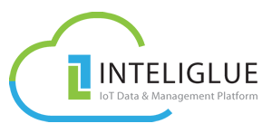
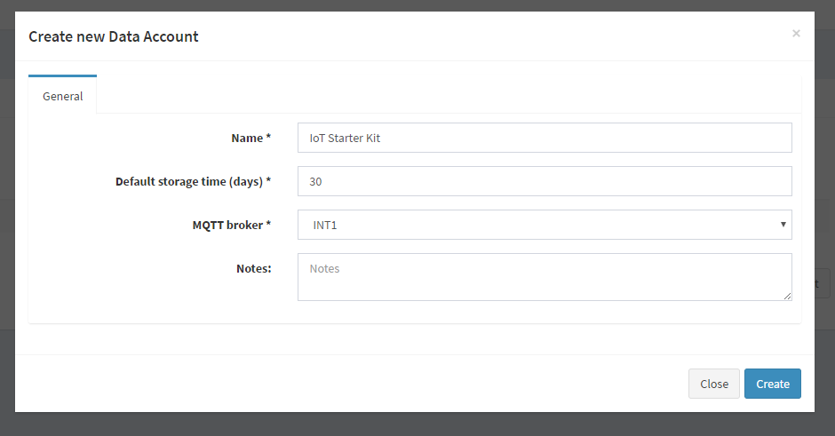
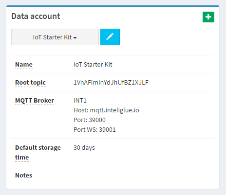
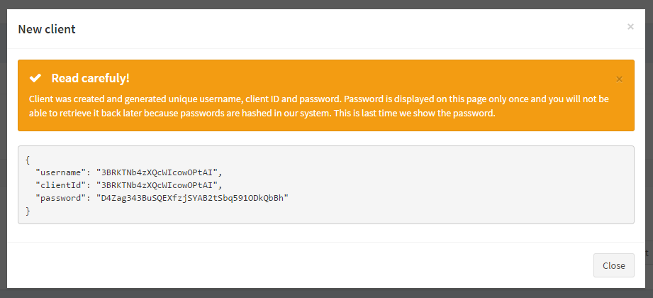
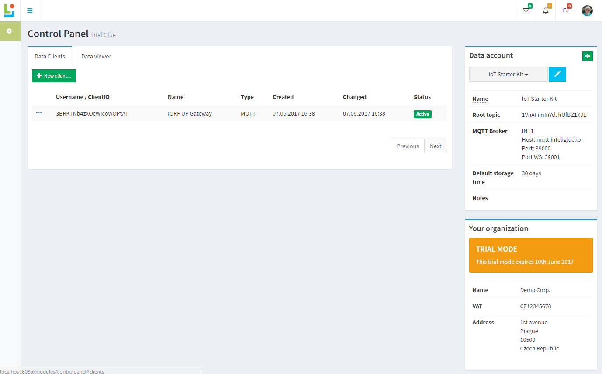

# How to setup InteliGlue&reg; data platform

>Inteliments provides IoT data and management platform InteliGlue&reg; which acquires, stores and analyses data from field gateways or sensors connected to various networks. InteliGlue&reg; is a highly scalable platform, provided as a Software as a Service (SaaS). It is built on open communication and connectivity standards. The platform is unopinionated and can be configured to any specific solution and used instantly.

## Important links
* [About InteliGlue](https://inteliments.com/en/products-and-services/iot-data-platform)
* [InteliGlue docs](https://inteliments.com/static/docs/inteliglue/)

> InteliGlue provides managed MQTT broker for MQTT connections. Because IQRF UP Gateway support MQTT protocol, MQTT connection will be configured for this demo.

## Approach

1. Start with [registering free trial account](https://inteliments.com/en/forms/inteliglue-trial)
2. Once you get your account access, login to [InteliGlue Portal](https://portal.inteliglue.io)
3. Create new Data Account, you name it
  
  * Copy paste your Data Account root topic at your IoT Starter Kit web MQTT interface configuration. You will find this information in Data Account side panel.
  
4. Create new MQTT Data Client "Data Clients" tab for your IQRF gateway
  
  * After new data client is created, copy paste your credentials from the screen (user your credentials / not from this screenshot).
  
  * Copy paste your "User" and "Password" with credentials you got on the screen at the IoT Starter Kit web configuration. Please note, that "ClientID" must be same value as "User".
5. To get data from your Data Account, create another MQTT Data Client to subscribe data and process them in real time or / and create HTTP Data Client to use REST API to fetch your collected time series data. You can also use "Data viewer" tab to see collected data at web user interface.
6. Make sure, that your BrokerAddr property matches your Data Account MQTT broker configuration.

# Contact

We prefer personal contact, please do not hesitate to get in touch with us.

* E: [office@inteliments.com](mailto:office@inteliments.com)
* W: [https://inteliments.com](https://inteliments.com)
* A: Technology and Development Center, Technology Center Hradec Králové, Piletická 486/19, 503 41 Hradec Králové, Czech Republic
* A: Inteliments Business Development Center, Apparaten Fabriek STRIJP-S, Torenallee 26-50, 5617 BD Eindhoven, The Netherlands

