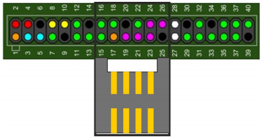
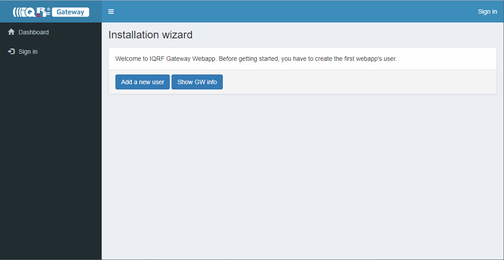
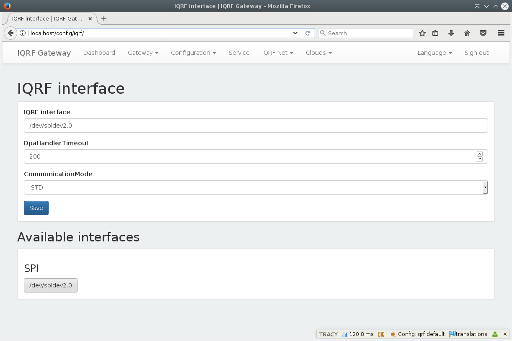
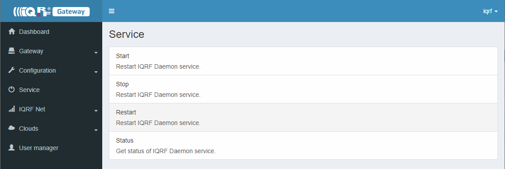
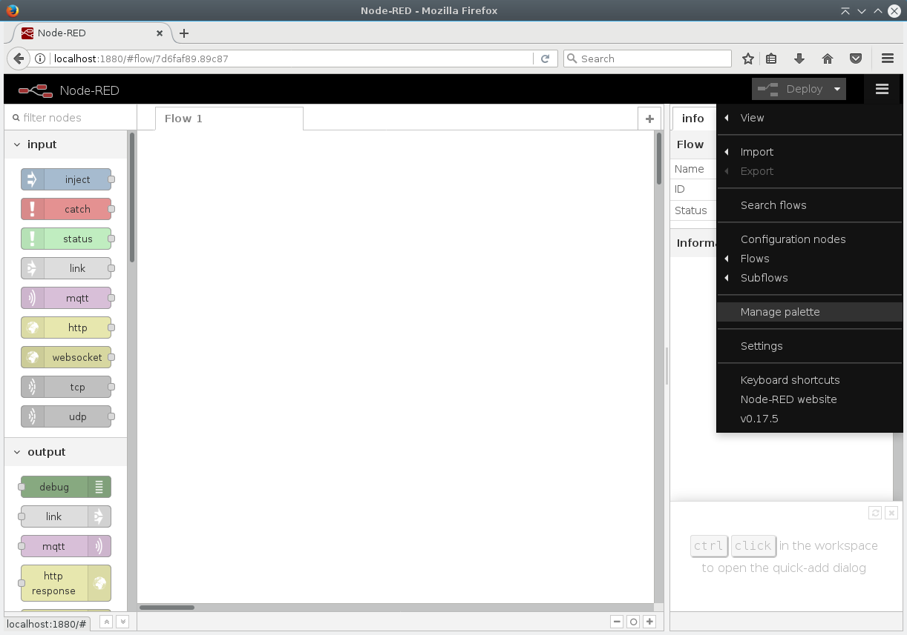
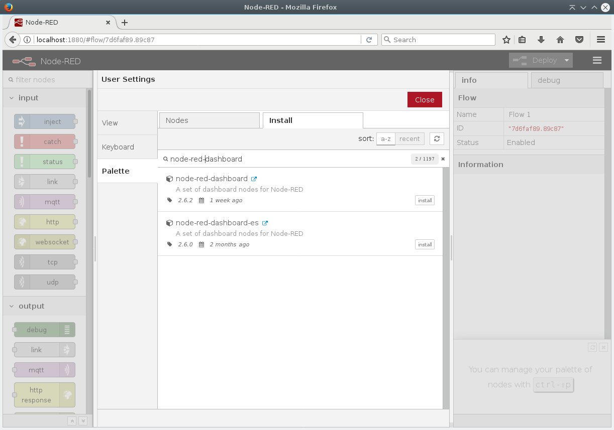
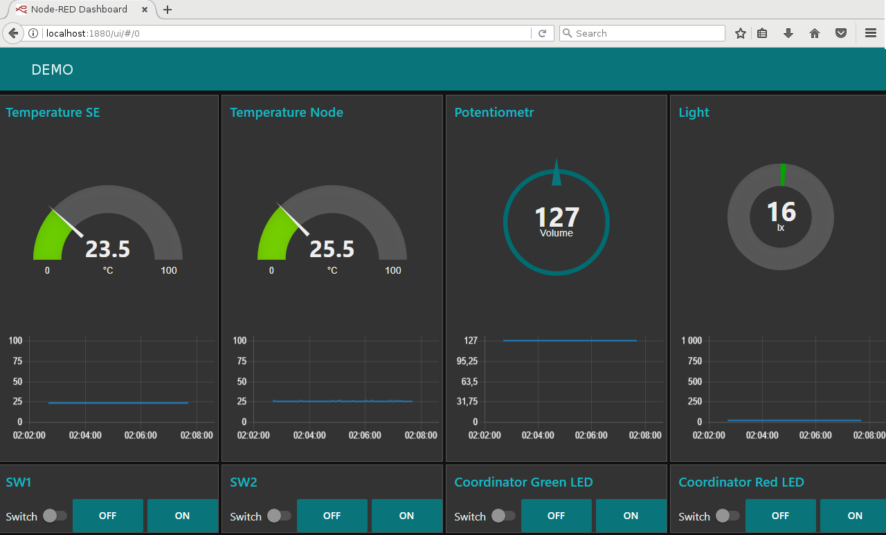
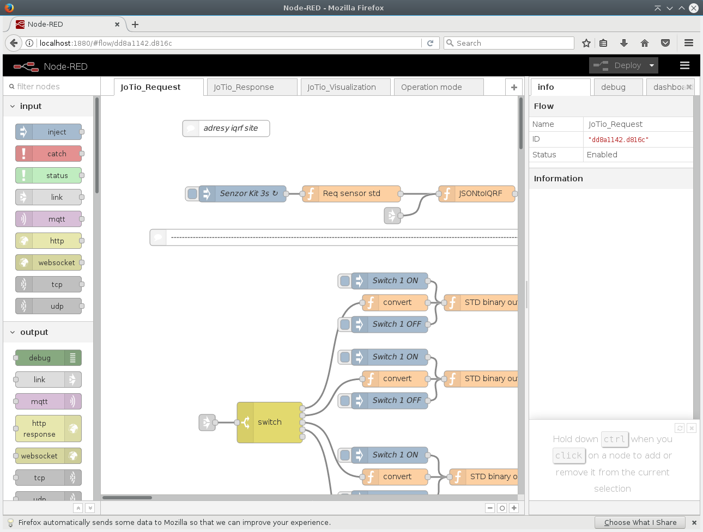
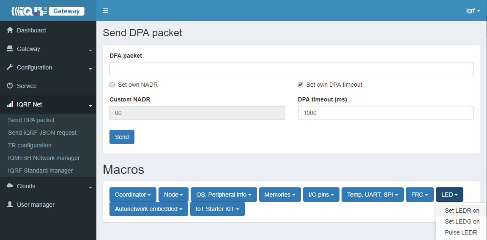
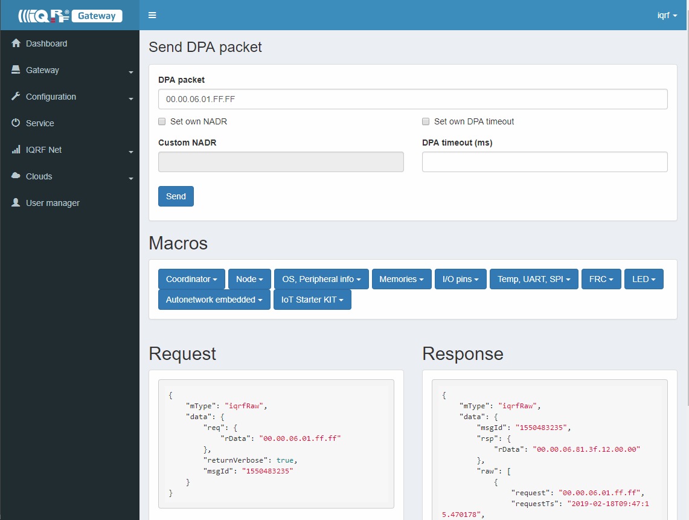

# IoT Starter Kit - Part 2: IQRF Gateway RPI

## Step 1 - Insert IQRF coordinator



* Attach [IQRF SPI board](http://www.iqrf.org/weben/downloads.php?id=412)
* Insert prepared IQRF Coordinator to the IQRF SPI board

## Step 2 - Install OS Linux

* Download [Raspbian Lite](https://downloads.raspberrypi.org/raspbian_lite_latest)
* Burn Raspbian Lite iso image to SD card or USB flash by [Etcher](https://etcher.io/)
* default login: user=pi; pass=raspberry

## Step 3A - Update Raspbian Lite

```bash
sudo apt-get update && sudo apt-get -y full-upgrade
```

## Step 3B - Install SSH server and start it

```bash
sudo apt-get install -y ssh
sudo systemctl enable ssh.service && sudo systemctl start ssh.service
```

Now you can connect to Raspberry via SSH client from your PC e.g. using [Putty](http://www.putty.org/) client.

```bash
sudo ifconfig
```

Ifconfig tells you the IP address of your Raspberry. Use it in your Putty client. Login is default, see above.

## Step 3C - Enable SPI on Raspberry

Edit config.txt

```bash
sudo nano /boot/config.txt
```

and uncomment dtparam=spi=on and reboot Raspberry by:

```bash
sudo reboot
```

After reboot login again using Putty client.

## Step 4A - Install MQTT broker

```bash
sudo apt-get install -y mosquitto mosquitto-clients
```

### Step 4B - Confirm MQTT broker is running

```bash
systemctl status mosquitto.service
```
```bash
pi@raspberrypi:~ $ systemctl status mosquitto.service
â mosquitto.service - LSB: mosquitto MQTT v3.1 message broker
   Loaded: loaded (/etc/init.d/mosquitto; generated; vendor preset: enabled)
   Active: active (running) since Tue 2017-12-12 23:37:19 UTC; 6min ago
     Docs: man:systemd-sysv-generator(8)
   CGroup: /system.slice/mosquitto.service
           ââ15266 /usr/sbin/mosquitto -c /etc/mosquitto/mosquitto.conf

Dec 12 23:37:19 raspberrypi systemd[1]: Starting LSB: mosquitto MQTT v3.1 message broker...
Dec 12 23:37:19 raspberrypi mosquitto[15260]: Starting network daemon:: mosquitto.
Dec 12 23:37:19 raspberrypi systemd[1]: Started LSB: mosquitto MQTT v3.1 message broker.
```

### Step 4C (optional) - Static password and ACL file

These steps describe how to setup Mosquitto with a static password and ACL file.

Using the mosquitto_passwd command, it is possible to create a password file for authentication.

#### Create password for <user_name> (pi)

Example to create a password file and add add an username (use the -c only the first time as it will create a new file):

```bash
sudo mosquitto_passwd -c /etc/mosquitto/passwd <user_name>
```

#### Create ACL file

* Add [ACL file](mosquitto/acls) 
to your /etc/mosquitto folder

#### Modify mosquitto configuration

* Include lines to enable authorization as in [configuration file](mosquitto/mosquitto.conf) to your /etc/mosquitto/mosquitto.conf file

* Restart MQTT broker

```bash
sudo systemctl restart mosquitto.service
```

### Step 4D (optional) - Enable websockets

#### Modify mosquitto configuration

* Include lines to enable websocket as in [configuration file](mosquitto/mosquitto.conf) to your /etc/mosquitto/mosquitto.conf file

* Restart MQTT broker

```bash
sudo systemctl restart mosquitto.service
```

## Step 5A - Stop IQRF Gateway Daemon v1

```bash
sudo systemctl stop iqrf-daemon
sudo systemctl disable iqrf-daemon
```

## Step 5B - Install IQRF Gateway Daemon

```bash
sudo apt-get install -y dirmngr apt-transport-https
sudo apt-key adv --keyserver keyserver.ubuntu.com --recv-keys 9C076FCC7AB8F2E43C2AB0E73241B9B7B4BD8F8E
echo "deb http://repos.iqrf.org/debian stretch stable testing" | sudo tee -a /etc/apt/sources.list.d/iqrf-gateway.list
sudo apt-get update && sudo apt-get install -y iqrf-gateway-daemon
```

### Step 5C - Confirm IQRF Gateway Daemon is running

```bash
systemctl status iqrf-gateway-daemon.service
```

## Step 6A - Install IQRF Gateway Daemon WebApp

```bash
sudo apt-get -y install apt-transport-https lsb-release ca-certificates dirmngr
sudo apt-key adv --keyserver keyserver.ubuntu.com --recv-keys D93B0C12C8D04D7AAFBCFA27CCD91D6111A06851
sudo sh -c 'echo "deb https://repozytorium.mati75.eu/raspbian stretch-backports main contrib non-free" > /etc/apt/sources.list.d/php.list'
sudo apt-get update && sudo apt-get install -y iqrf-gateway-webapp
```

### Step 6B - Confirm IQRF Gateway Daemon WebApp is running

```bash
http://localhost/
```


* Create your own login credentials

## Step 7A - Configure IQRF SPI interface

```bash
http://localhost/config/iqrf-spi/
```


* Select available interface!
* Save new configuration!

### Step 7B - Restart IQRF Gateway Daemon

```bash
http://localhost/service
```


* Hit Restart!

## Step 8A - Install Node.js

```bash
sudo apt-get install -y curl
curl -sL https://deb.nodesource.com/setup_6.x | sudo -E bash -
sudo apt-get install nodejs
```

## Step 9A - Install Node-RED

```bash
sudo npm install -g --unsafe-perm node-red
sudo npm install -g pm2
```

### Step 9B - Start Node-RED

```bash
cd /home/pi
pm2 start /usr/bin/node-red --node-args="--max-old-space-size=128"
```

### Step 9C - Add Node-RED dashboard

```bash
http://your-rpi-ip:1880
```



### Step 9D - Run IoT-Starter-Kit flow

```bash
cd /home/pi
git clone https://gitlab.iqrf.org/alliance/iot-starter-kit.git
cd iot-starter-kit/install
cp rpi-board/node-red/* /home/pi/.node-red
pm2 restart node-red
```

### Step 9E - Allow Node-RED to run after reboot

```bash
pm2 save
```
```bash
[PM2] Saving current process list...
[PM2] Successfully saved in /home/pi/.pm2/dump.pm2
```

```bash
pm2 startup
```
```bash
[PM2] Init System found: systemd
[PM2] To setup the Startup Script, copy/paste the following command:
sudo env PATH=$PATH:/usr/bin /usr/lib/node_modules/pm2/bin/pm2 startup systemd -u pi --hp /home/pi
```

```bash
sudo env PATH=$PATH:/usr/bin /usr/lib/node_modules/pm2/bin/pm2 startup systemd -u pi --hp /home/pi
```

### Step 9F - Confirm Node-RED is running

```bash
systemctl status pm2-pi
```
```bash
â pm2-pi.service - PM2 process manager
   Loaded: loaded (/etc/systemd/system/pm2-pi.service; enabled; vendor preset: enabled)
   Active: active (running) since Thu 2017-11-23 01:20:09 UTC; 1min 10s ago
     Docs: https://pm2.keymetrics.io/
 Main PID: 21952 (PM2 v2.7.2: God)
   CGroup: /system.slice/pm2-pi.service
           ⣠21952 PM2 v2.7.2: God Daemon (/home/pi/.pm2)
```

## Step 10A - Check Node-RED dashboard

```bash
http://localhost:1880/ui
```


### Step 10B - Check Node-RED flow

```bash
http://localhost:1880
```


### Step 10C - Blink coordinator LEDR from IQRF Gateway Daemon WebApp

```bash
http://localhost/iqrfnet/send-raw
```


* Select macro Pulse LEDR and send it!



* Learn JSON DPA RAW structure!

### Step 10D - Inspect JSON messages between Node-RED and IQRF Gateway Daemon

* Listen for all JSON DPA RAW Requests

```bash
mosquitto_sub -t Iqrf/DpaRequest
```

* Listen for all JSON DPA RAW Responses

```bash
mosquitto_sub -t Iqrf/DpaResponse
```

### Step 10E - Check our examples

```bash
cd /home/pi
git clone https://gitlab.iqrf.org/open-source/iqrf-gateway-daemon.git
cd iqrf-gateway-daemon/examples
```

* Contribution to the examples very much appreciated!

Enjoy and spred the joy!
