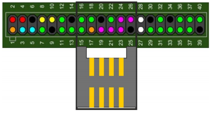
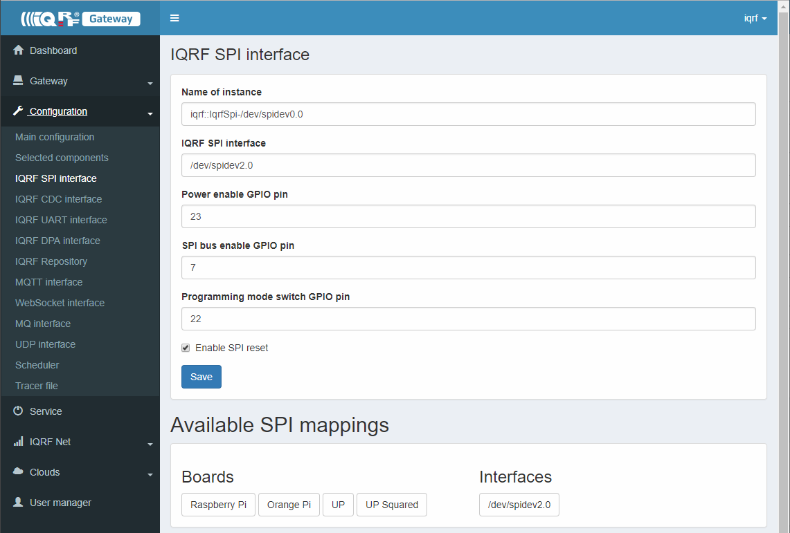
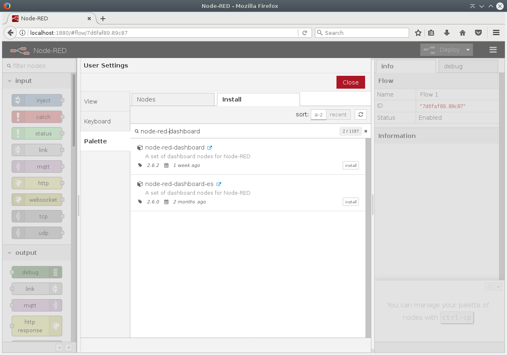
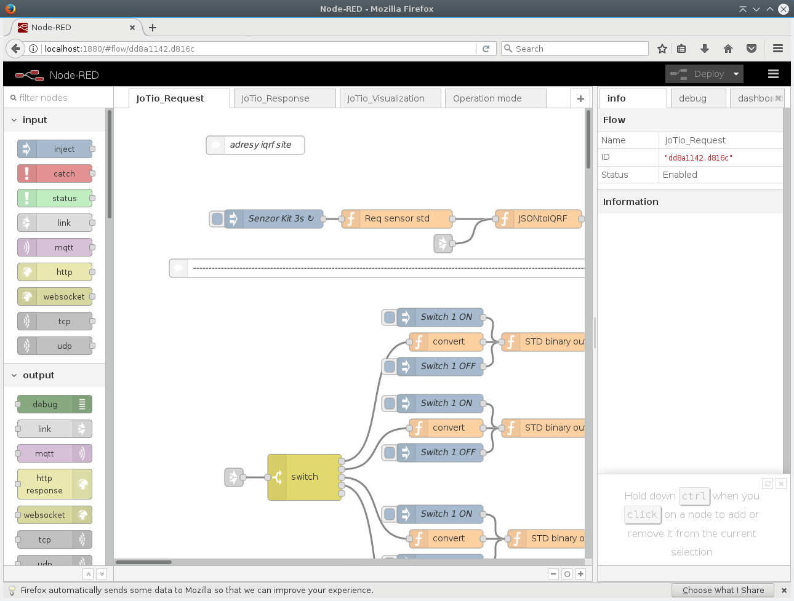
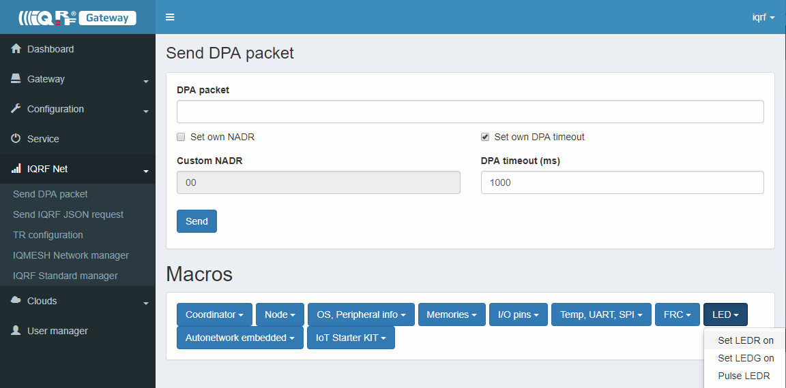

# IoT Starter Kit - Part 2: IQRF GW

## Step 1 - Insert IQRF coordinator



* Attach [IQRF SPI board](http://www.iqrf.org/weben/downloads.php?id=412)
* Insert prepared IQRF Coordinator to the IQRF SPI board

## Step 2 - Install OS Linux

* Download [UbiLinux 4.0](https://emutex.com/products/ubilinux)
* Burn UbiLinux 4.0 iso image to USB flash by [Etcher](https://etcher.io/)
* default login: user=ubilinux; pass=ubilinux

## Step 3 - Update UbiLinux 4.0

```bash
sudo apt-get update && sudo apt-get -y full-upgrade
```

## Step 4A - Install MQTT broker

```bash
sudo apt-get install -y mosquitto mosquitto-clients
```

### Step 4B - Confirm MQTT broker is running

```bash
systemctl status mosquitto.service
```
```bash
ubilinux@ubilinux:~$ systemctl status mosquitto.service
â mosquitto.service - LSB: mosquitto MQTT v3.1 message broker
   Loaded: loaded (/etc/init.d/mosquitto; generated; vendor preset: enabled)
   Active: active (running) since Wed 2017-11-22 17:24:13 UTC; 1min 59s ago
     Docs: man:systemd-sysv-generator(8)
   CGroup: /system.slice/mosquitto.service
           ââ14253 /usr/sbin/mosquitto -c /etc/mosquitto/mosquitto.conf
```

## Step 5A - Install IQRF Gateway Daemon

```bash
sudo apt-get install -y dirmngr apt-transport-https
sudo apt-key adv --keyserver keyserver.ubuntu.com --recv-keys 9C076FCC7AB8F2E43C2AB0E73241B9B7B4BD8F8E
echo "deb https://repos.iqrf.org/debian stretch stable testing" | sudo tee -a /etc/apt/sources.list.d/iqrf-gateway.list
sudo apt-get update && sudo apt-get install -y iqrf-gateway-daemon
```

### Step 5B - Confirm IQRF Gateway Daemon is running

```bash
systemctl status iqrf-gateway-daemon.service
```

## Step 6A - Install IQRF Gateway Daemon WebApp

```bash
sudo apt-get -y install apt-transport-https lsb-release ca-certificates
sudo wget -O /etc/apt/trusted.gpg.d/php.gpg https://packages.sury.org/php/apt.gpg
sudo sh -c 'echo "deb https://packages.sury.org/php/ stretch main" > /etc/apt/sources.list.d/php.list'
sudo apt-get update && sudo apt-get install -y iqrf-gateway-webapp
```

### Step 6B - Confirm IQRF Gateway Daemon WebApp is running

```bash
http://localhost/
```


* Create your own login credentials

## Step 7A - Configure IQRF SPI interface

```bash
http://localhost/config/iqrf-spi/
```


* Select available interface!
* Save new configuration!

### Step 7B - Restart IQRF Gateway Daemon

```bash
http://localhost/service
```


* Hit Restart!

## Step 8A - Install Node.js and Node-RED

```bash
cd /home/ubilinux
git clone https://gitlab.iqrf.org/alliance/iot-starter-kit.git
cd iot-starter-kit/install
sudo cp etc/lsb-release-debian /etc/lsb-release
sudo apt-get install curl
bash <(curl -sL https://raw.githubusercontent.com/node-red/linux-installers/master/deb/update-nodejs-and-nodered)
sudo cp etc/lsb-release-ubilinux /etc/lsb-release
```

## Step 9A - Start Node-RED

```bash
sudo systemctl enable nodered.service
sudo systemctl start nodered.service
```

### Step 9B - Add Node-RED dashboard

```bash
http://localhost:1880
```



### Step 9C - Run IoT-Starter-Kit flow

```bash
cd /home/ubilinux/iot-starter-kit/install
cp up-board/node-red/* /home/ubilinux/.node-red
sudo systemctl restart nodered.service
```

### Step 9D - Confirm Node-RED is running

```bash
systemctl status nodered.service
```
```bash
â nodered.service - Node-RED graphical event wiring tool
   Loaded: loaded (/etc/systemd/system/nodered.service; enabled; vendor preset: enabled)
   Active: active (running) since Thu 2019-11-29 01:20:09 UTC; 1min 10s ago
     Docs: http://nodered.org/docs/hardware/raspberrypi.html
 Main PID: 20773 (node-red)
   CGroup: /system.slice/nodered.service
           ⣠20773 node-red
```

## Step 10A - Check Node-RED dashboard

```bash
http://localhost:1880/ui
```


### Step 10B - Check Node-RED flow

```bash
http://localhost:1880
```


### Step 10C - Blink coordinator LEDR from IQRF Gateway Daemon WebAPP

```bash
http://localhost/iqrfnet/send-raw
```


* Select macro Pulse LEDR and send it!


* Learn JSON DPA RAW structure!

### Step 10D - Inspect JSON messages between Node-RED and IQRF Gateway Daemon

* Listen for all JSON DPA RAW Requests

```bash
mosquitto_sub -t Iqrf/DpaRequest
```

* Listen for all JSON DPA RAW Responses

```bash
mosquitto_sub -t Iqrf/DpaResponse
```

### Step 10E - Check our examples

```bash
cd /home/ubilinux
git clone https://gitlab.iqrf.org/open-source/iqrf-gateway-daemon.git
cd iqrf-gateway-daemon/examples
```

* Contribution to the examples very much appreciated!

Enjoy and spred the joy!
